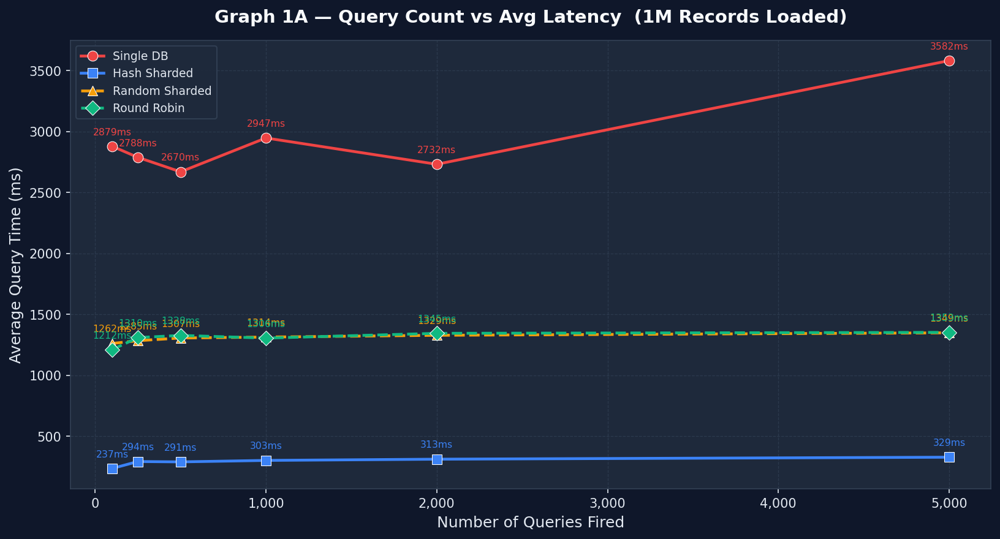
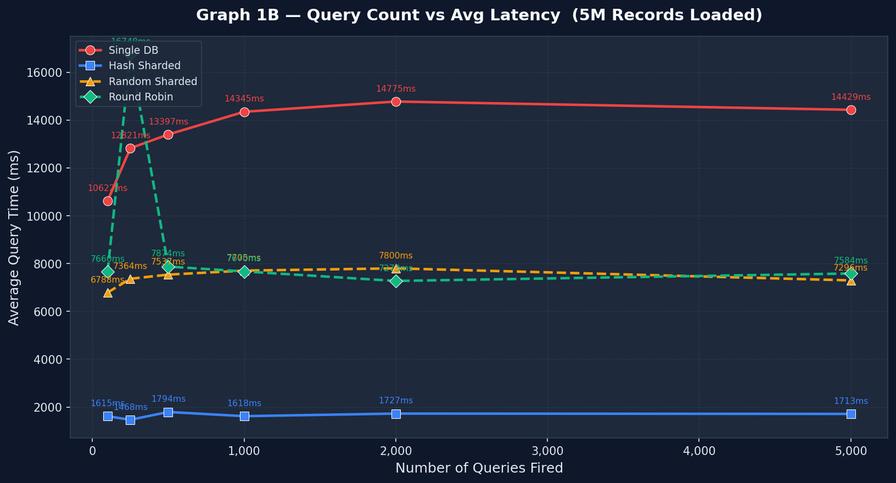

# Database Sharding Simulation — Distributed Systems Benchmark

> **EmpowerMe Mentorship Project** | EverPure (Pure Storage) | Mentor: Vidisha Attili

A distributed database sharding simulator that compares **5 architectures** across 3 MongoDB nodes, benchmarked with up to **10 million records** — achieving **89.1% query latency reduction** with Hash-Based Sharding.

---

## Architecture

```
┌────────┐    ┌────────────────┐    ┌──────────┐    ┌───────────┐
│ Client │ →  │ Central Server │ →  │ Backend  │ →  │  MongoDB  │
│        │    │   port 5000    │    │ port 5001│    │  Shard 1  │
└────────┘    │  (routing +    │    ├──────────┤    ├───────────┤
              │   async I/O)   │ →  │ Backend  │ →  │  MongoDB  │
              │                │    │ port 5002│    │  Shard 2  │
              └────────────────┘    ├──────────┤    ├───────────┤
                                 →  │ Backend  │ →  │  MongoDB  │
                                    │ port 5003│    │  Shard 3  │
                                    └──────────┘    └───────────┘
```

## 5 Architectures Compared

| Architecture | Routing Strategy | Read Complexity | Key Trade-off |
|---|---|---|---|
| **Single DB** (Baseline) | Direct proxy | O(n) full scan | No distribution |
| **Hash-Based** | `hash(id) % 3` | O(n/3) direct | Can't add shards easily |
| **Random** | `random.choice([0,1,2])` | O(n) scatter-gather | 3x read cost |
| **Round Robin** | `counter % 3` | O(n) scatter-gather | 3x read cost |
| **Directory-Based** | Lookup table | O(n/3) + lookup hop | Extra DB trip per read |

## Key Results

### 10 Million Records Benchmark

| Metric | Single DB | Hash Sharded | Improvement |
|---|---|---|---|
| **Avg Query Time** | 27,437 ms | 2,992 ms | **89.1% faster** |
| Fastest Query | 206 ms | 33 ms | 84% faster |
| Slowest Query | 131,405 ms | 14,020 ms | 89% faster |
| Median | 24,838 ms | 2,148 ms | 91% faster |

> Test conditions: 500 queries · 10 concurrent workers · No index (full collection scan) · Docker isolated containers

### Benchmark Graphs

<p align="center">
  
  
</p>

## Obstacles Faced & Solutions

| Problem | Root Cause | Fix |
|---|---|---|
| Sharding showed no improvement | MongoDB index made all lookups O(1) | Removed index → forced full collection scan |
| Central server bottleneck | Sequential request processing | Rewrote with `asyncio` + `aiohttp` |
| Single DB unfairly fast | Had 3 backend servers instead of 1 | Reduced to 1 backend, 1 database |
| Inconsistent benchmarks | All architectures sharing same RAM/CPU | Dockerized with isolated resources |
| OS caching interference | WSL2 bypassed Docker RAM limits | Removed artificial memory caps |

## Tech Stack

- **Backend:** Python, Flask, asyncio, aiohttp
- **Database:** MongoDB (NoSQL), PyMongo
- **Infrastructure:** Docker, Docker Compose
- **Benchmarking:** ThreadPoolExecutor, matplotlib, numpy
- **Concurrency:** asyncio, aiohttp, concurrent.futures

## Project Structure

```
distributed-sharding-system/
├── single_db_instance/          # Baseline — 1 backend, 1 MongoDB
│   ├── backend_server.py
│   ├── central_server.py
│   ├── data_loader.py
│   ├── client.py
│   ├── Dockerfile
│   └── docker-compose.yml
│
├── sharded_version/             # Hash-Based Sharding (hash(id) % 3)
│   ├── backend_server.py
│   ├── central_server.py
│   ├── data_loader.py
│   ├── client.py
│   ├── Dockerfile
│   └── docker-compose.yml
│
├── random_sharding/             # Random shard assignment
│   ├── backend_server.py
│   ├── central_server.py
│   ├── data_loader.py
│   ├── client.py
│   ├── Dockerfile
│   └── docker-compose.yml
│
├── round_robin_sharding/        # Cyclic shard assignment
│   ├── backend_server.py
│   ├── central_server.py
│   ├── data_loader.py
│   ├── client.py
│   ├── Dockerfile
│   └── docker-compose.yml
│
├── directory_based_sharding/    # Lookup-table based routing
│   ├── backend_server.py
│   ├── central_server.py
│   ├── data_loader.py
│   ├── client.py
│   ├── Dockerfile
│   └── docker-compose.yml
│
├── benchmark_vary_queries_1M.py # Benchmark: 1M records, vary query count
├── benchmark_vary_queries_5M.py # Benchmark: 5M records, vary query count
├── benchmark_vary_load.py       # Benchmark: vary data size (1M-5M)
├── client.py                    # Live demo script for split-screen comparison
├── graph1A_vary_queries_1M.png  # Results graph — 1M
├── graph1B_vary_queries_5M.png  # Results graph — 5M
└── README.md
```

## How to Run

### Prerequisites
- Docker & Docker Compose
- Python 3.8+
- `pip install flask pymongo faker requests matplotlib numpy aiohttp`

### Run any architecture
```bash
cd single_db_instance          # or sharded_version, random_sharding, etc.
docker-compose up -d --build
python -c "import data_loader; data_loader.load_data(total=1000000)"
python client.py
docker-compose down
```

### Run benchmarks
```bash
python benchmark_vary_queries_1M.py --arch single_db
python benchmark_vary_queries_1M.py --arch hash_sharded
python benchmark_vary_queries_1M.py --arch random_sharded
python benchmark_vary_queries_1M.py --arch round_robin
python benchmark_vary_queries_1M.py --arch directory_based
```

## Key Learnings

- Sharding benefits only show up at scale with heavy queries — indexes mask the advantage
- Fair benchmarking requires isolated resources (Docker) and controlled variables
- Scatter-gather routing (Random/Round Robin) costs 3x per read vs direct routing (Hash)
- Debugging performance issues requires understanding the full stack — from OS caching to DB indexes

## Author

**Chithsukhi C V** — Final Year CSE, GSSSIETW Mysuru
- [LinkedIn](https://linkedin.com/in/chithsukhicv)
- [GitHub](https://github.com/Chithsukhicv)

*Built as part of the EmpowerMe Mentorship Program at EverPure (Pure Storage), mentored by Vidisha Attili.*
